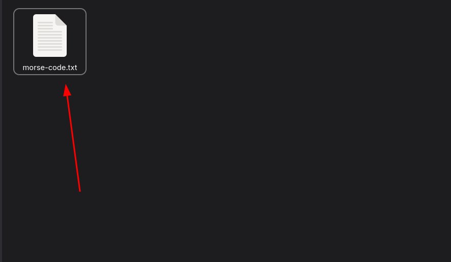

<p align="center">
  <h1 align="center">Morsify</h1>
  <p align="center">🔤 ➡️ 🔵 Decode and Encode Text to Morse Code in Bash, Fast and Easy!</p>
  
  <p align="center">
    <a href="LICENSE">
      
    </a>
    
    
    
    
  </p>
</p>

## 📸 Screenshots

<p align="center">
  
  <br><em>Encode text into Morse Code</em>
</p>

<p align="center">
  
  <br><em>Encode text into Morse Code (save the file in .txt)</em>
</p>

<p align="center">
  
  <br><em>Encoded File .txt</em>
</p>

<p align="center">
  
  <br><em>Decode Morse Code into text</em>
</p>

<p align="center">
  
  <br><em>Decode Morse Code into text (save the file in .txt)</em>
</p>

<p align="center">
  
  <br><em>Decoded File .txt</em>
</p>

---

# 🛰️ Morsify

> A simple, fast, beautiful Morse Code encoder/decoder written in pure Bash.  
> No dependencies. No bloat. Just dot-dash perfection.

---

## ✨ Features

- Encode any text into Morse Code
- Decode Morse Code back into readable text
- Supports manual input and reading from files
- Smart file saving (auto filenames if needed)
- Beep sounds for dots and dashes (optional)
- Detects if input is Morse or text automatically
- Fully portable - works on any Linux/Mac terminal
- Clean colorful user interface (with error handling)

---

## 🔧 How It Works

Morsify is a command-line tool designed to **encode** and **decode** text in **Morse code** using **Bash**. It allows users to easily convert regular text into Morse code or vice versa. The tool supports both **manual input** and **file input**, and provides options to **output the result to the console** or save it to a **file**.

Morsify works by utilizing a predefined **Morse code dictionary** that maps each character (letters, numbers, and special symbols) to its corresponding Morse code equivalent. After you provide input (either text or a file), Morsify converts the input and displays or saves the result.

### Key Features:
- **Text-to-Morse Conversion**: Converts plain text into Morse code.
- **Morse-to-Text Conversion**: Converts Morse code into human-readable text.
- **File Input/Output**: You can provide files as input and output the results to a file.
- **Interactive Mode**: A simple, interactive interface to guide you through encoding or decoding.
  
---

## 📜 Commands List

Morsify offers a set of commands to interact with the tool. You can either use the interactive mode or provide specific commands:

- **`morsify`**  
  Launches the interactive mode where you can choose between encoding or decoding text.

- **`morsify encode [input_text_or_file] [output_file_path]`**  
  Converts the provided text or file into Morse code. Optionally, you can provide a path to save the output to a file.

- **`morsify decode [input_morse_or_file] [output_file_path]`**  
  Converts the provided Morse code or Morse file back into human-readable text. Optionally, you can provide a path to save the output to a file.

- **`morsify --help`**  
  Displays a helpful guide showing the available commands and their descriptions.

---

## 🏃 Usage

### Start the tool:

Simply run: **Recommended**

```bash
morsify
```

You will be prompted to choose whether you want to **encode** or **decode** text. Follow the on-screen instructions to complete your task.

### Example 1: Encode Text to Morse

To encode a string of text into Morse code:

```bash
morsify encode "Hello World"
```

This will display the Morse code in the terminal or save it to the specified file.

### Example 2: Decode Morse Code to Text

To decode a string of Morse code into human-readable text:

```bash
morsify decode "-- .... . .-.. .-.. --- / .-- --- .-. .-.. -.."
```

This will output the decoded text, **Hello World**.

### Example 3: Encode from a File

If you have a file (`input.txt`) with text you want to encode:

```bash
morsify encode input.txt output.txt
```

This will read the file `input.txt`, encode the content into Morse code, and save the output to `output.txt`.

### Example 4: Decode from a File

If you have a file (`morse_input.txt`) with Morse code, you can decode it to text:

```bash
morsify decode morse_input.txt decoded_output.txt
```

This will read the Morse code from `morse_input.txt`, decode it, and save the decoded text to `decoded_output.txt`.

---

## 📝 Summary of Commands

| Command                         | Description                                                 |
|----------------------------------|-------------------------------------------------------------|
| `morsify`                       | Launch the interactive mode.                               |
| `morsify encode [input_text]`   | Encode text to Morse code.                                  |
| `morsify decode [input_morse]`  | Decode Morse code to human-readable text.                   |
| `morsify --help`                | Show available commands and usage instructions.             |

---

## 📦 Installation

You have multiple easy ways to install **Morsify**:

---

### 📥 1. Clone the Repository (Manual)

```bash
git clone https://github.com/codewithmoss/morsify.git
cd morsify
chmod +x morsify.sh
```

(Optional: Install system-wide)

```bash
sudo cp morsify.sh /usr/local/bin/morsify
```

Now you can simply run:

```bash
morsify
```

---

### 📥 2. Install from AUR (for Arch Linux users)

If you use an AUR helper like `yay` or `paru`:

```bash
yay -S morsify
```
or
```bash
paru -S morsify
```

✅ Automatically installs and sets up!

Or manually clone and build:

```bash
git clone https://aur.archlinux.org/morsify.git
cd morsify
makepkg -si
```
✅ Now you can use mkfromtree anywhere!

---

### 📥 3. Install via CURL (Simple install script)

Use this method if you want **one-line installation** from GitHub:

```bash
curl -s https://raw.githubusercontent.com/codewithmoss/morsify/main/install.sh | bash
```

> This will automatically download `morsify.sh` and place it into `/usr/local/bin/`.


# 📜 **How it works now:**

| Step | What Happens                                               |
|-----|-------------------------------------------------------------|
| 1    | Downloads the file to `/tmp/` (user always has access).    |
| 2    | Uses `sudo` to move it safely to `/usr/local/bin/`.         |
| 3    | Makes it executable with `chmod +x`.                       |
| 4    | Shows success message, ready to use `morsify`.             |

---

### 📥 4. Install .deb Package (for Debian/Ubuntu)

If you have the `.deb` package downloaded:

```bash
sudo dpkg -i morsify-1.0.0.deb
```

If missing dependencies occur, fix them with:

```bash
sudo apt --fix-broken install
```

✅ Now `morsify` is installed globally.

---


## 📄 License

This project is licensed under the [MIT License](LICENSE).

---

## ❤️ Contributing

Pull requests are welcome. Feel free to fork and improve the project!

---

## 📞 Contact

Made with ☕ and 🔥 by [RAI SULEMAN](https://github.com/codewithmoss)

---
